# API REST `api-alumnos` con AWS Lambda y usando Serverless Framework**

### **Objetivo**

Desarrollar una API REST completa para gestionar alumnos usando arquitectura **Serverless**, DynamoDB como base de datos NoSQL y funciones Lambda para cada operación CRUD. 

El despliegue se realizó mediante **Serverless Framework**, exponiendo cada Lambda como endpoint HTTP a través de API Gateway.

---

### **Primeros Pasos**

Primero hay que modificar el repositorio con las funciones a usar, y de ahi clonar ese repositorio en la MV ya que dentro de su carpeta haremos aplicaremos todos los pasos:

Repo inicial: 

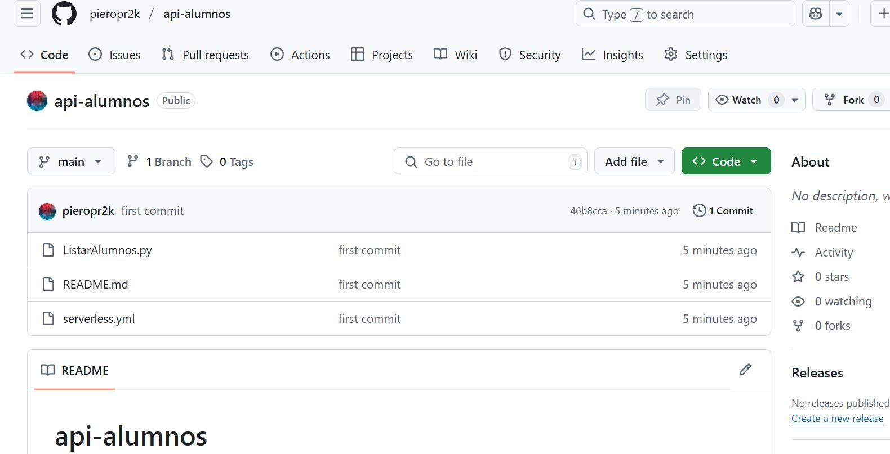

Actualizar el repo con las nuevas funciones y luego clonarlo en la MV:

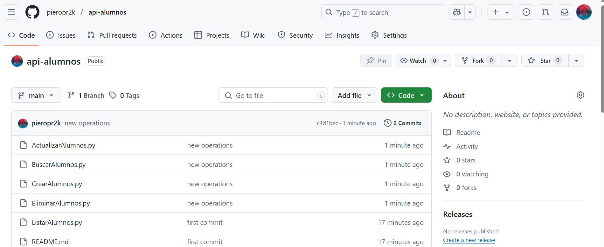

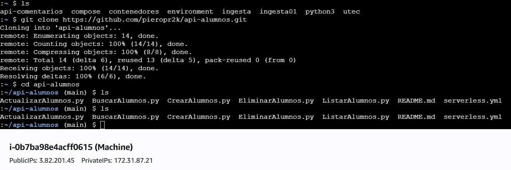

### **Funciones Implementadas**

A continuación, se describen las 5 funciones Lambda que conforman el sistema:

| Función              | Descripción                                                           | Método HTTP | Ruta                  |
| -------------------- | --------------------------------------------------------------------- | ----------- | --------------------- |
| **ListarAlumnos**    | Lista todos los alumnos registrados bajo un `tenant_id`.              | `POST`      | `/alumnos/listar`     |
| **CrearAlumno**      | Crea un nuevo alumno con su información personal y datos de contacto. | `POST`      | `/alumnos/crear`      |
| **BuscarAlumno**     | Busca un alumno específico por `tenant_id` y `alumno_id`.             | `POST`      | `/alumnos/buscar`     |
| **ActualizarAlumno** | Modifica la información de un alumno ya registrado.                   | `PUT`       | `/alumnos/actualizar` |
| **EliminarAlumno**   | Elimina un alumno identificado por `tenant_id` y `alumno_id`.         | `DELETE`    | `/alumnos/eliminar`   |

---

### **Estructura de la tabla DynamoDB**

* **Tabla:** `t_alumnos`
* **Clave primaria compuesta:**

  * Partition Key: `tenant_id` (cadena)
  * Sort Key: `alumno_id` (cadena)
* **Atributo adicional:** `alumno_datos` (Map JSON con datos personales)

---

## **Detalles de cada Lambda**

####  **ListarAlumnos**

* Entrada: `{ "tenant_id": "UNIV2" }`
* Salida: Lista de todos los alumnos asociados a ese tenant.

#### **CrearAlumno**

* Entrada:

  ```json
  {
    "tenant_id": "UNIV2",
    "alumno_id": "A2020F9999",
    "alumno_datos": {
      "nombre": { "S": "Juan Pérez" },
      "fecha_nac": { "S": "2004-08-15" },
      ...
    }
  }
  ```
* Operación: Inserta un nuevo ítem en la tabla.

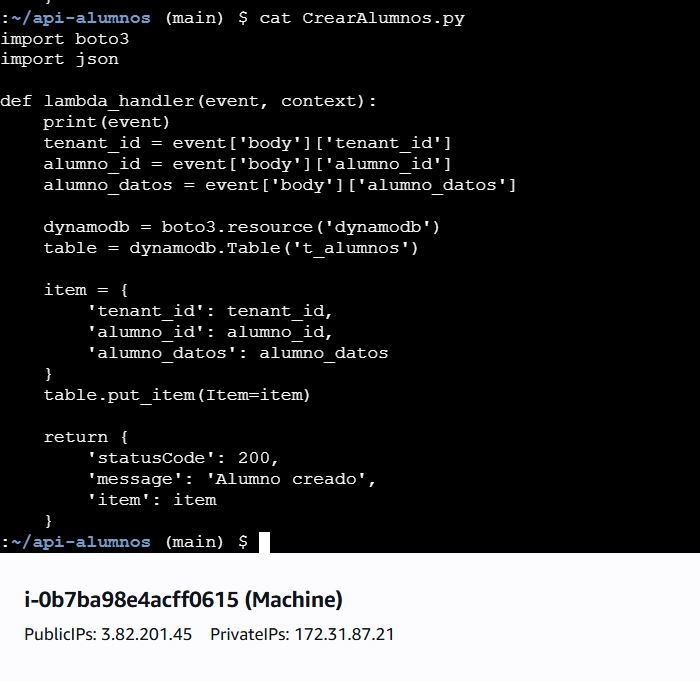

#### **BuscarAlumno**

* Entrada:

  ```json
  {
    "tenant_id": "UNIV2",
    "alumno_id": "A2020F4565"
  }
  ```
* Salida: Devuelve los datos del alumno si existe.

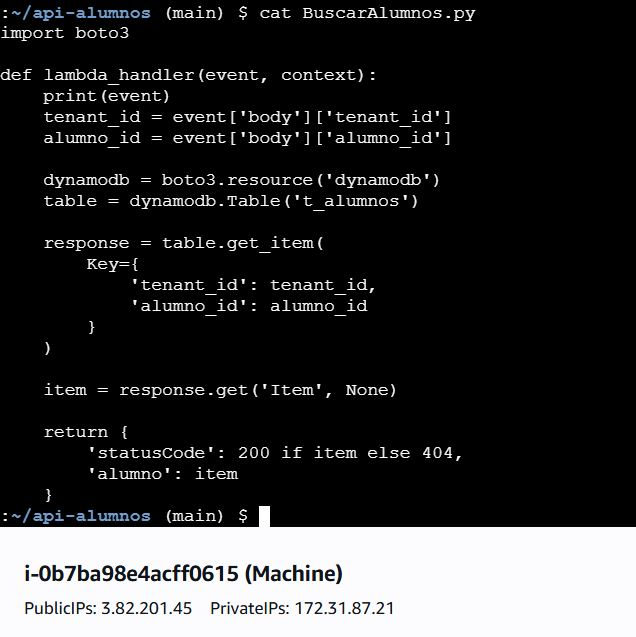

#### **ActualizarAlumno**

* Entrada:

  ```json
  {
    "tenant_id": "UNIV2",
    "alumno_id": "A2020F4565",
    "alumno_datos": {
      "nombre": { "S": "Pedro Luna Modificado" },
      ...
    }
  }
  ```
* Operación: Reemplaza `alumno_datos` con la nueva información.

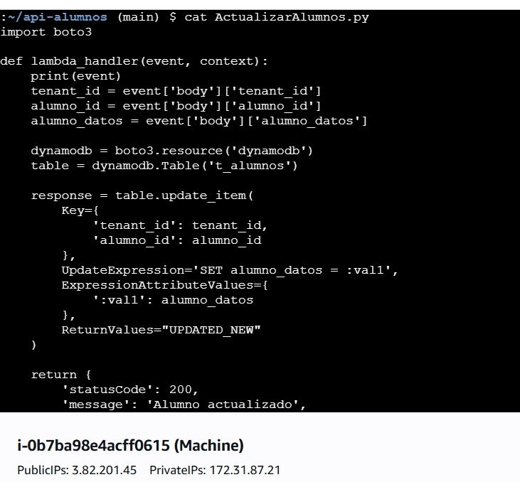

#### **EliminarAlumno**

* Entrada:

  ```json
  {
    "tenant_id": "UNIV2",
    "alumno_id": "A2020F4565"
  }
  ```
* Operación: Elimina el alumno especificado.

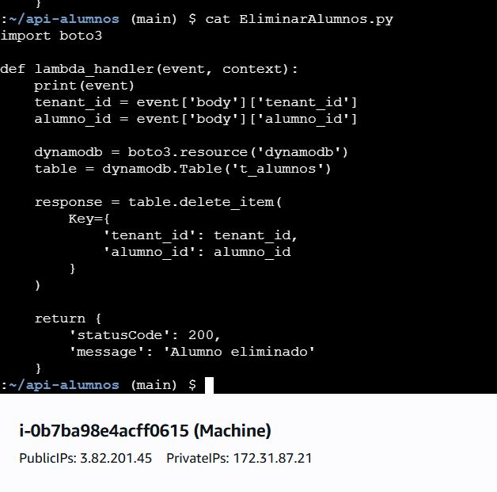

---

### **Archivo `serverless.yml`**

Se definió un archivo `serverless.yml` para orquestar todo el despliegue con Serverless Framework, asignando un `IAM Role` con permisos suficientes para DynamoDB.

```yaml
org: pieropilco
service: api-alumnos

provider:
  name: aws
  runtime: python3.12
  timeout: 30
  iam:
    role: arn:aws:iam::123456789:role/LabRole

functions:
  listar:
    handler: ListarAlumnos.lambda_handler
    events:
      - http:
          path: /alumnos/listar
          method: post
          cors: true

  crear:
    handler: CrearAlumno.lambda_handler
    events:
      - http:
          path: /alumnos/crear
          method: post
          cors: true

  obtener:
    handler: BuscarAlumno.lambda_handler
    events:
      - http:
          path: /alumnos/buscar
          method: post
          cors: true

  actualizar:
    handler: ActualizarAlumno.lambda_handler
    events:
      - http:
          path: /alumnos/actualizar
          method: put
          cors: true

  eliminar:
    handler: EliminarAlumno.lambda_handler
    events:
      - http:
          path: /alumnos/eliminar
          method: delete
          cors: true
```

---

### **Credenciales y permisos**

* Se configuró un `LabRole` con políticas para permitir operaciones `PutItem`, `GetItem`, `Query`, `UpdateItem` y `DeleteItem` sobre la tabla `t_alumnos`.
* Se verificó que cada Lambda tenga asociado el rol correcto.

---

### **Despliegue**

1. Credenciales configuradas con `aws configure`.

- Copiamos las credenciales del CLI:

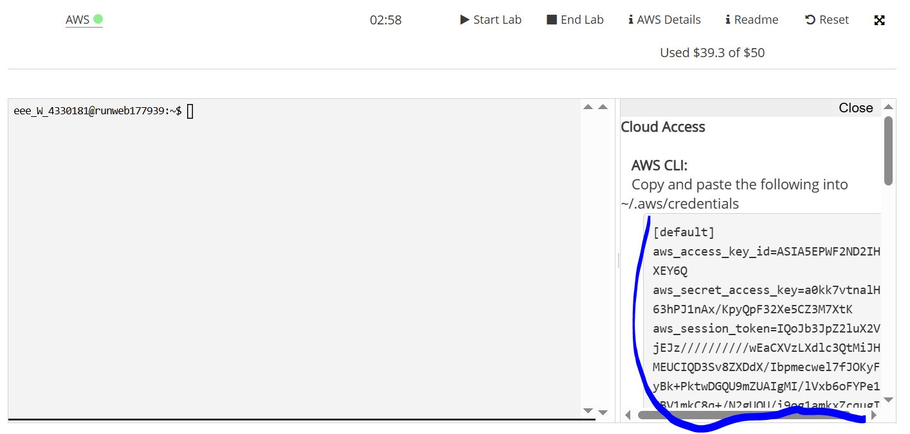

- Pegamos en el archivo credentials en la carpeta `.aws`:

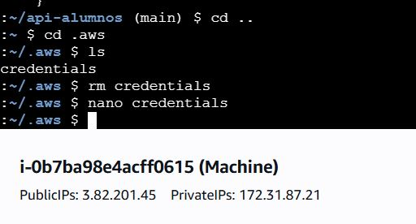

2. Modificar el serverless:

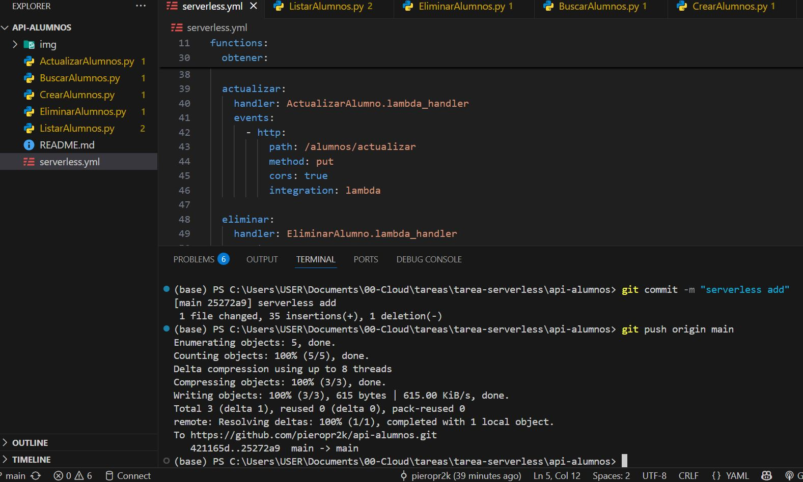

3. Despliegue ejecutado con:

   ```bash
   serverless deploy
   ```

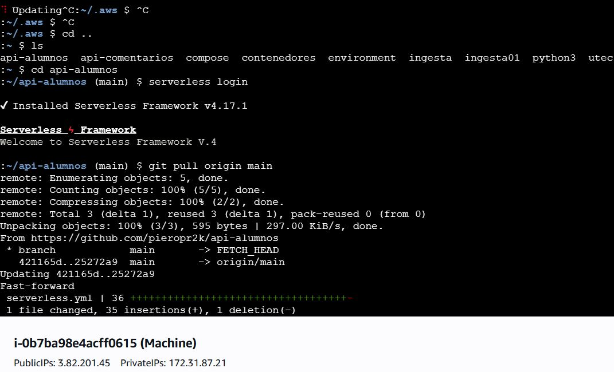

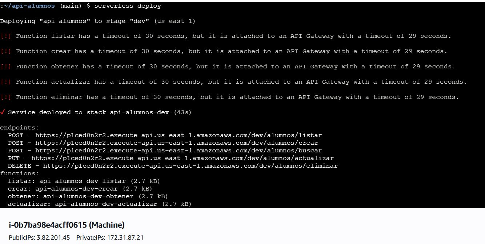

4. Una vez realizado el deploy se puede ver que Serverless crea una api en nuestra cuenta como 'dev-api-alumnos':

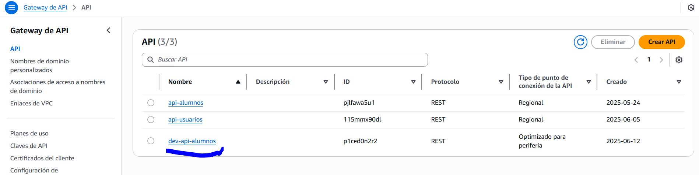


5. Sigue verificar todos endpoints.

---

### **Pruebas**

Se realizaron las siguientes validaciones:

✅ Crear un alumno y verificar su aparición en la lista.

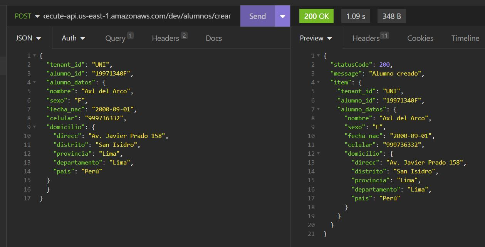

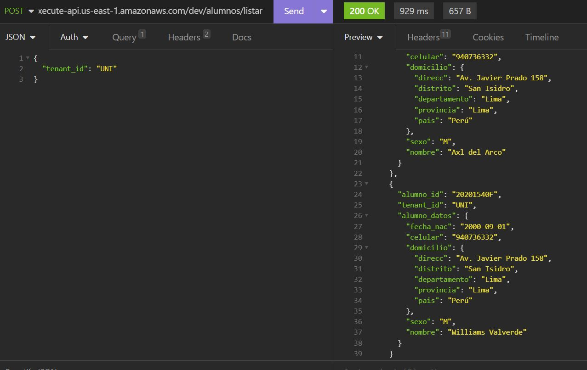

✅ Buscar el alumno recién creado.

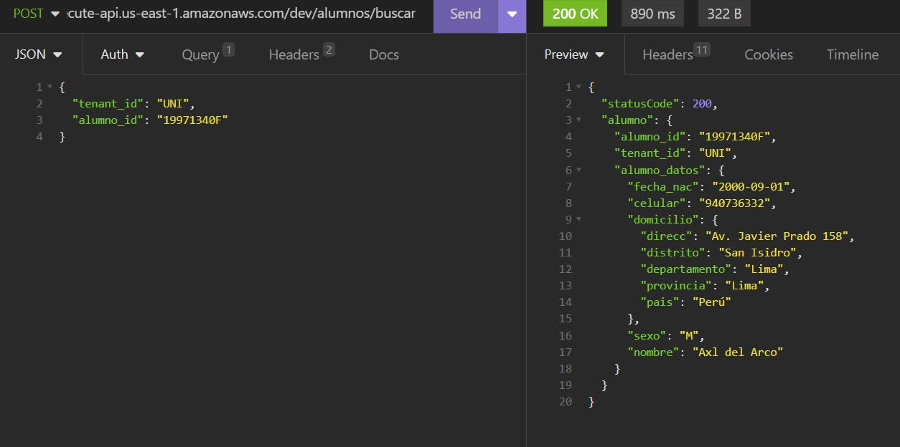

✅ Modificar sus datos y validar que el cambio se vea en una nueva consulta.

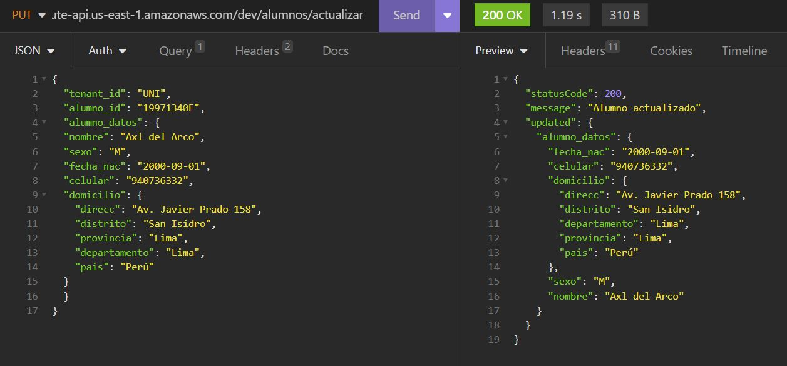

✅ Eliminar el alumno y verificarlo en la lista.

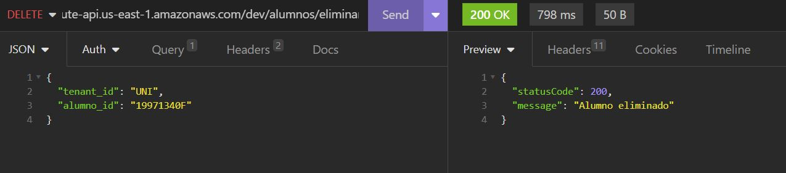

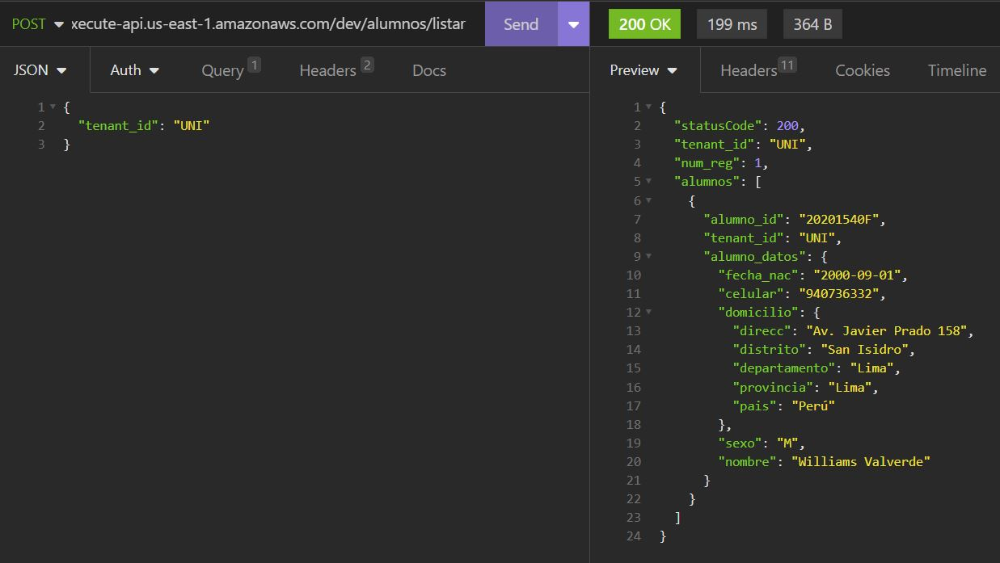

Se puede ver que los datos quedan registrados en DynamoDB:

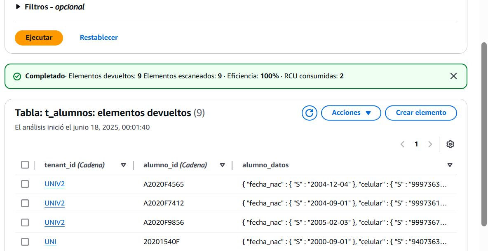

---

### **Conclusiones**

* Se logró implementar una API REST **serverless** 100% funcional, escalable y de bajo costo operativo.
* La arquitectura permite aislar la lógica de negocio en funciones Lambda independientes.
* El uso de DynamoDB simplifica la administración de la base de datos sin servidores.
* El despliegue con **Serverless Framework** optimiza la gestión de recursos en AWS.